# Git-Sync


---

## Overview

**Git-Sync** is a senior-level, fully automated CLI dashboard written in pure Bash. It eliminates the repetitive friction of Git initialization, commit, and push workflows by wrapping the entire process inside a visually rich, keyboard-driven terminal UI — no third-party dependencies, no frameworks, no compromises.

At its core, Git-Sync handles repository detection, smart hidden-file globbing, automatic `.gitignore` scaffolding, staged commits, remote push with pre-flight validation, and raw single-keypress input with full arrow-key navigation — all rendered through a custom ANSI 256-color interface complete with background-processed braille spinners, box-drawn panels, and state-aware callback blocks. It is designed to be installed globally and hooked directly into your Zsh shell, making it a zero-effort, always-present safety net that fires automatically before any `python`, `python3`, or `node` execution.

This is not a wrapper script. It is a production-grade terminal application built entirely from shell primitives.

---

## Features

- **Custom ANSI 256-Color UI** — Full neon-purple themed interface with box-drawn section headers, horizontal rules, styled status icons (`✔ ✘ ℹ ⚠ ›`), and a persistent ASCII art banner rendered on every screen transition.
- **Arrow-Key Navigation** — Full `↑` / `↓` menu navigation with live highlight tracking and wraparound. Selection is rendered with a `❯` prefix and colored background. Compatible with macOS bash 3.2 and Linux bash 5+.
- **Background-Processed Braille Spinner** — Non-blocking animated spinner (`⠋⠙⠹⠸⠼⠴⠦⠧⠇⠏`) running as a forked subprocess, killed cleanly after each async operation completes.
- **ESC-Aware Raw Key Reader** — Single-keypress navigation with byte-by-byte ANSI escape sequence disambiguation. Bare `ESC` exits; arrow-key sequences are decoded individually without fractional timeouts, ensuring cross-platform compatibility.
- **Smart Hidden-File Globbing** — Uses the `.[!.]* *` glob pattern to capture all files including dotfiles (e.g. `.gitignore`, `.env`) while explicitly excluding `.` and `..`, and always skipping the `.git` directory.
- **State-Aware Callback Blocks** — Every logical branch surfaces a styled feedback banner. Nothing-to-commit, no-remote, branch-behind-remote, empty-directory, commit-failure, and push-failure all produce distinct visual callbacks with recovery hints.
- **Push to Remote** — Full pre-flight validation before any `git push`: checks for `.git`, configured remote, at least one commit, and ahead/behind status relative to the remote branch.
- **Automatic `.gitignore` Scaffolding** — Generates a comprehensive `.gitignore` on first init covering Python, Node.js, OS artifacts, IDEs, and log files — only if one does not already exist.
- **Global Zsh Hook Integration** — Installs as a system-wide binary and hooks into `~/.zshrc` aliases so that `python`, `python3`, and `node` commands silently trigger the Git-Sync UI before execution in any terminal session, including VS Code's integrated terminal.
- **Conditional Git Init** — Detects existing repositories and skips initialization gracefully, preventing double-init errors.
- **Cursor & Terminal State Management** — Hides the cursor during menus, restores it unconditionally via `trap` on any exit signal, ensuring the terminal is never left in a broken state.
- **macOS / Linux Cross-Compatible** — All `grep`, `sed`, and `read` calls use POSIX-safe patterns. No `-P` Perl-regex flags, no fractional `-t` timeouts.

---

## Architectural Diagrams

### Flowchart — Full Execution Flow

```mermaid
flowchart TD
    A([Start: menu]) --> B[draw_menu with selected=0]
    B --> C[read_key: wait for keypress]
    C --> D{Key pressed?}

    D -- "↑ UP" --> E[selected = selected - 1 mod 3]
    D -- "↓ DOWN" --> F[selected = selected + 1 mod 3]
    E --> B
    F --> B

    D -- "ENTER on row 0 / key 1" --> G[initializer_helper]
    D -- "ENTER on row 1 / key 3" --> H[push_helper]
    D -- "ENTER on row 2 / ESC / Q" --> I[draw_banner\nGoodbye message]
    I --> J([Exit])
    D -- "Other" --> B

    G --> K{.git exists?}
    K -- Yes --> L[print: already initialized\nchecker = -1]
    K -- No --> M[git init\nchecker = 0]
    M --> N[gitignore_creator_helper]
    N --> O{.gitignore exists?}
    O -- No --> P[Write .gitignore]
    O -- Yes --> Q[Skip: warn user]

    L --> R[Glob: .[!.]* *\nexclude .git]
    P --> R
    Q --> R

    R --> S{f_counter?}
    S -- "= 0" --> T[callback: No files found]
    S -- "= 1" --> U[git add single file]
    S -- "> 1" --> V[Show tree / list\ngit add .]

    T --> W([return])
    U --> X[git diff --cached check]
    V --> X

    X --> Y{Staged changes?}
    Y -- No --> Z[callback: Nothing to commit]
    Z --> W

    Y -- Yes --> AA[Show staged file list]
    AA --> AB[get_commit_message]
    AB --> AC[git commit -m result]
    AC --> AD{commit exit code?}
    AD -- 0 --> AE[callback: Committed OK]
    AD -- non-0 --> AF[callback: Commit failed]
    AE --> AG[Press any key → menu]
    AF --> AG
    AG --> B

    H --> AH{.git exists?}
    AH -- No --> AI[callback: No repo found]
    AI --> AG

    AH -- Yes --> AJ{Remote configured?}
    AJ -- No --> AK[callback: No remote]
    AK --> AG

    AJ -- Yes --> AL{HEAD commit exists?}
    AL -- No --> AM[callback: No commits yet]
    AM --> AG

    AL -- Yes --> AN{Branch ahead/behind?}
    AN -- "behind" --> AO[callback: Pull first]
    AO --> AG
    AN -- "ahead / unknown" --> AP[start_spinner push]
    AP --> AQ[git push origin branch]
    AQ --> AR{push exit code?}
    AR -- 0 --> AS[callback: Push OK]
    AR -- non-0 --> AT[callback: Push failed]
    AS --> AG
    AT --> AG
```

---

### DFD Level 0 — Context Diagram

```mermaid
flowchart LR
    U(["👤 User\n(Terminal)"])
    GS["⬡ Git-Sync System"]
    FS[("💾 Local File System\n& Git Repository")]
    REM[("☁️ Remote\nOrigin / GitHub")]

    U -- "Keypress Input\n(↑↓ / ↵ / ESC / Q / 1 / 3)" --> GS
    GS -- "UI Output\n(ANSI Rendered Screen)" --> U
    GS -- "git init / add / commit\n.gitignore write" --> FS
    FS -- "File glob results\n.git existence check\nstaged diff" --> GS
    GS -- "git push origin branch" --> REM
    REM -- "push exit status\nahead/behind status" --> GS
```



---

### DFD Level 1 — Process Breakdown


---

### State Diagram — Menu Navigation


---

## Pseudocode & Algorithms

### `read_key` — Byte-by-Byte ESC-Aware Key Reader

macOS ships bash 3.2 which does not support fractional second timeouts (e.g. `-t 0.05`). The original two-byte read with a fractional timeout would silently fail, causing every arrow key to register as a bare `ESC` and trigger the exit branch. The fix reads one byte at a time with integer timeouts.

```
FUNCTION read_key():

    READ exactly 1 byte silently → key

    IF key == 0x1B (ESC byte):

        // Arrow keys emit 3 bytes: 0x1B  0x5B  0x41/0x42
        //                           ESC    [     A=UP / B=DOWN
        // Read byte 2 with 1-second integer timeout (works on bash 3.2+)

        READ 1 byte with timeout 1s → b1

        IF b1 IS EMPTY:
            // No byte followed — genuine bare ESC keypress
            RETURN "ESC"

        ELSE IF b1 == "[":
            // Confirmed escape sequence — read the identifying byte
            READ 1 byte with timeout 1s → b2

            CASE b2:
                "A" → RETURN "UP"
                "B" → RETURN "DOWN"
                *   → RETURN "SEQ:[" + b2

        ELSE:
            RETURN "SEQ:" + b1

    ELSE IF key == "" (empty / newline):
        RETURN "ENTER"

    ELSE IF key == "q" OR "Q":
        RETURN "QUIT"

    ELSE IF key == "1":
        RETURN "1"

    ELSE IF key == "3":
        RETURN "3"

    ELSE:
        RETURN "OTHER:" + key

END FUNCTION
```

---

### `menu` — Arrow-Key Navigation Loop

```
FUNCTION menu():

    SET selected = 0          // index of highlighted row
    SET MENU_ITEMS = ["Run Git-Sync", "Push to Remote", "Exit"]
    SET MENU_COUNT = 3

    LOOP forever:

        hide_cursor()
        draw_menu(selected)   // redraws entire screen with highlight on selected
        SET choice = read_key()

        CASE choice:

            "UP":
                selected = (selected - 1 + MENU_COUNT) mod MENU_COUNT
                // wrap from top → bottom

            "DOWN":
                selected = (selected + 1) mod MENU_COUNT
                // wrap from bottom → top

            "ENTER":
                IF selected == 0 → CALL initializer_helper()
                IF selected == 1 → CALL push_helper()
                IF selected == 2 → print goodbye; BREAK

            "1":
                CALL initializer_helper()   // direct shortcut

            "3":
                CALL push_helper()          // direct shortcut

            "ESC" OR "QUIT":
                print goodbye; BREAK

            *:
                // invalid key — redraw silently, no flicker

        END CASE

    END LOOP

END FUNCTION
```

---

### `initializer_helper` — Hidden File Globbing Logic

```
FUNCTION initializer_helper():

    SET checker = 1

    IF directory ".git" EXISTS:
        PRINT "Repository already initialized"
        SET checker = -1
    ELSE:
        SET checker = 0
        EXECUTE: git init
        CALL gitignore_creator_helper()
    END IF

    SET real_files = empty array

    // Smart glob: two patterns expanded simultaneously by the shell
    // .[!.]*  → dotfiles where second char is NOT "." → .gitignore, .env
    //           excludes "." and ".." which both start with ".."
    // *       → all non-hidden files → main.py, README.md, index.js

    FOR each entry f IN GLOB(.[!.]*, *):
        IF f EXISTS AND f != ".git":
            APPEND f TO real_files
    END FOR

    SET f_counter = LENGTH(real_files)

    IF f_counter == 0:
        SHOW callback: "No files found — nothing to stage"
        RETURN early

    ELSE IF f_counter == 1:
        EXECUTE: git add real_files[0]

    ELSE:
        DISPLAY tree or fallback file list
        EXECUTE: git add .
    END IF

    // Check index after staging — files may be unchanged since last commit
    SET staged = git diff --cached --name-only

    IF staged IS EMPTY:
        SHOW callback: "Nothing to commit — repo already up to date"
        RETURN early
    END IF

    DISPLAY list of staged files with "+" prefix
    SET result = CALL get_commit_message()
    EXECUTE: git commit -m result → capture exit_code

    IF exit_code == 0:
        SHOW success banner: "Committed: result"
    ELSE:
        SHOW callback: "Commit failed"

END FUNCTION
```

---

### `push_helper` — Push Pre-flight & Execution

```
FUNCTION push_helper():

    // Gate 1 — repository must exist
    IF ".git" does NOT exist:
        SHOW callback: "No repo found — run Git-Sync first"
        RETURN early

    // Gate 2 — at least one remote must be configured
    SET remotes = git remote
    IF remotes IS EMPTY:
        SHOW callback: "No remote configured"
        HINT: git remote add origin <url>
        RETURN early

    SET current_branch = git branch --show-current

    // Gate 3 — at least one commit must exist
    IF git rev-parse HEAD FAILS:
        SHOW callback: "No commits yet — commit first"
        RETURN early

    // Gate 4 — branch sync status check
    SET status = git status --porcelain=v1 --branch | grep "^##"

    IF status contains "ahead":
        SET ahead_count = extract number from status using sed
        PRINT remote URL, branch, ahead_count commits ready

    ELSE IF status contains "behind":
        SHOW callback: "Branch behind remote — pull first"
        HINT: git pull origin branch
        RETURN early

    ELSE:
        PRINT remote URL, branch
        WARN: may already be up to date

    // All gates passed — execute push
    start_spinner("Pushing to origin...")
    EXECUTE: git push origin current_branch → capture exit_status
    stop_spinner()

    IF exit_status == 0:
        SHOW success banner: "Pushed to origin/branch"
    ELSE:
        SHOW callback: "Push failed — check network or conflicts"
        HINT: verify SSH key or token

END FUNCTION
```

---

### `print_callback` — Unified State Feedback Renderer

```
FUNCTION print_callback(icon, message, background_color, foreground_color):

    // Renders a full-width highlighted banner block
    // Used for every terminal state: warn, error, success variant
    // All four parameters are ANSI escape code strings

    PRINT blank line
    PRINT: "  " + background_color + foreground_color + BOLD
           + "  " + icon + "  " + message + "  " + RESET
    PRINT blank line

END FUNCTION
```

---

## Callback State Reference

Every possible terminal state in Git-Sync surfaces a styled callback block. The table below maps each state to its trigger condition, visual style, and recovery hint shown to the user.

| State | Trigger | Color | Icon | Recovery Hint |
|---|---|---|---|---|
| Nothing to commit | `git diff --cached` empty | Yellow BG | `◎` | No action needed |
| No files in directory | `f_counter == 0` | Yellow BG | `◎` | Add files to directory |
| Commit failed | `git commit` exit ≠ 0 | Red BG | `✘` | Check git config |
| No repository | `.git` missing in push | Red BG | `✘` | Run option 1 first |
| No remote configured | `git remote` empty | Yellow BG | `◎` | `git remote add origin` |
| No commits yet | `git rev-parse HEAD` fails | Yellow BG | `◎` | Commit with option 1 |
| Branch behind remote | status contains `behind` | Yellow BG | `◎` | `git pull origin branch` |
| Push failed | `git push` exit ≠ 0 | Red BG | `✘` | Check SSH key / token |

---

## Keyboard Reference

| Key | Action |
|---|---|
| `↑` | Move menu highlight up (wraps) |
| `↓` | Move menu highlight down (wraps) |
| `↵ Enter` | Confirm highlighted menu row |
| `1` | Direct shortcut → Run Git-Sync |
| `3` | Direct shortcut → Push to Remote |
| `Esc` | Exit program immediately |
| `Q` / `q` | Exit program immediately |

---

## Installation & Global Setup

### Step 1 — Make Executable & Move to Bin

```bash
chmod +x git-sync.sh
sudo cp git-sync.sh /usr/local/bin/git-sync
```

Once installed, invoke the dashboard from any directory:

```bash
git-sync
```

---

### Step 2 — Zsh Wrapper Automation

Add the following to `~/.zshrc`:

```bash
# Git-Sync Automation Wrapper
run_with_sync() {
    local cmd=$1
    shift
    git-sync
    command "$cmd" "$@"
}
alias python='run_with_sync python'
alias python3='run_with_sync python3'
alias node='run_with_sync node'
```

Activate immediately:

```bash
source ~/.zshrc
```

---

### Step 3 — VS Code Integration

No additional VS Code configuration is required. The Git-Sync hook registered via `~/.zshrc` aliases is inherited by the VS Code Integrated Terminal at startup.

> **Note:** Ensure your VS Code Integrated Terminal uses Zsh. Open the Command Palette (`⌘ Shift P` / `Ctrl Shift P`), search for `Terminal: Select Default Profile`, and select **zsh**.

---

## Usage Guide

### Manual

```bash
git-sync
```

Navigate with `↑` `↓`, confirm with `↵`, exit with `Esc` or `Q`.

### Automatic via Zsh Aliases

```bash
python3 main.py   # triggers Git-Sync first, then runs python3
python  script.py
node    server.js
```

Flow: `alias fires → run_with_sync → git-sync UI → user acts → original command runs`

---

## Project Structure

```
git-sync.sh
│
├── THEME & COLOR PALETTE       # ANSI 256-color variables, semantic aliases, BG_WARN, BG_ERROR
├── TERMINAL UTILS              # clear_screen, hide/show cursor, move_to, trap
├── SPINNER                     # Background-forked braille animation subprocess
├── STYLED OUTPUT HELPERS       # print_success/error/info/warn/step/callback, hr, section_header
├── BANNER                      # draw_banner — ASCII art header with subtitle
├── KEY READER                  # read_key — byte-by-byte ESC/arrow decoder, macOS compatible
├── COMMIT MESSAGE INPUT        # get_commit_message — /dev/tty safe prompt
├── GITIGNORE CREATOR           # gitignore_creator_helper — idempotent scaffold
├── GIT PROCESS HELPER          # initializer_helper — stage/commit with full callback coverage
├── PUSH TO REMOTE HELPER       # push_helper — 4-gate pre-flight + push execution
├── MENU RENDERER               # draw_menu — index-driven arrow-key highlight renderer
├── MENU LOOP                   # menu() — navigation state machine, shortcut dispatcher
└── ENTRY POINT                 # menu (called at bottom of script)
```

---

## License

This project is licensed under the [MIT License](LICENSE).
