# Git-Sync


---

## Overview

**Git-Sync** is a senior-level, fully automated CLI dashboard written in pure Bash. It eliminates the repetitive friction of Git initialization and commit workflows by wrapping the entire process inside a visually rich, keyboard-driven terminal UI — no third-party dependencies, no frameworks, no compromises.

At its core, Git-Sync handles repository detection, smart hidden-file globbing, automatic `.gitignore` scaffolding, staged commits, and raw single-keypress input — all rendered through a custom ANSI 256-color interface complete with background-processed braille spinners and box-drawn panels. It is designed to be installed globally and hooked directly into your Zsh shell, making it a zero-effort, always-present safety net that fires automatically before any `python`, `python3`, or `node` execution.

This is not a wrapper script. It is a production-grade terminal application built entirely from shell primitives.

---

## Features

- **Custom ANSI 256-Color UI** — Full neon-purple themed interface with box-drawn section headers, horizontal rules, styled status icons (`✔ ✘ ℹ ⚠`), and a persistent banner rendered on every screen transition.
- **Background-Processed Braille Spinner** — Non-blocking animated spinner (`⠋⠙⠹⠸⠼⠴⠦⠧⠇⠏`) running as a forked subprocess, killed cleanly after each async operation completes.
- **ESC-Aware Raw Key Reader** — Single-keypress navigation with full ANSI escape sequence disambiguation. Bare `ESC` exits; arrow-key sequences are safely consumed and ignored without polluting the input buffer.
- **Smart Hidden-File Globbing** — Uses the `.[!.]* *` glob pattern to capture all files including dotfiles (e.g. `.gitignore`, `.env`) while explicitly excluding `.` and `..`, and always skipping the `.git` directory.
- **Automatic `.gitignore` Scaffolding** — Generates a comprehensive `.gitignore` on first init covering Python, Node.js, OS artifacts, IDEs, and log files — only if one does not already exist.
- **Global Zsh Hook Integration** — Installs as a system-wide binary and hooks into `~/.zshrc` aliases so that `python`, `python3`, and `node` commands silently trigger the Git-Sync UI before execution in any terminal session, including VS Code's integrated terminal.
- **Conditional Git Init** — Detects existing repositories and skips initialization gracefully, preventing double-init errors.
- **Cursor & Terminal State Management** — Hides the cursor during menus, restores it unconditionally via `trap` on any exit signal, ensuring the terminal is never left in a broken state.

---

## Architectural Diagrams

### Flowchart — Execution Flow

```mermaid
flowchart TD
    A([Start: menu]) --> B[draw_menu]
    B --> C[read_key: wait for keypress]
    C --> D{Key pressed?}
    D -- "ENTER / 1" --> E[initializer_helper]
    D -- "ESC / Q / 2" --> F[draw_banner\nGoodbye message]
    F --> G([Exit])
    D -- "Other" --> B

    E --> H{.git directory\nexists?}
    H -- Yes --> I[print: already initialized\nchecker = -1]
    H -- No --> J[git init\nchecker = 0]
    J --> K[gitignore_creator_helper]
    K --> L{.gitignore\nexists?}
    L -- No --> M[Write .gitignore\nwith default patterns]
    L -- Yes --> N[Skip: warn user]

    I --> O[Glob files:\n.[!.]* and *\nexclude .git]
    M --> O
    N --> O

    O --> P{f_counter\nvalue?}
    P -- "= 0" --> Q[warn: No files to add]
    P -- "= 1" --> R[git add single file]
    P -- "> 1" --> S[Show tree or list\ngit add .]

    Q --> T[get_commit_message]
    R --> T
    S --> T

    T --> U[read msg from /dev/tty]
    U --> V[git commit -m result]
    V --> W[Print success banner]
    W --> X[Press any key to return]
    X --> B
```

---

### DFD Level 0 — Context Diagram

```mermaid
flowchart LR
    U(["👤 User\n(Terminal)"])
    GS["⬡ Git-Sync System"]
    FS[("💾 Local File System\n& Git Repository")]

    U -- "Keypress Input\n(ENTER / ESC / Q)" --> GS
    GS -- "UI Output\n(ANSI Rendered Screen)" --> U
    GS -- "git init / add / commit\n.gitignore write" --> FS
    FS -- "File glob results\n.git existence check" --> GS
```



---

### DFD Level 1 — Process Breakdown


---

## Pseudocode & Algorithms

### `initializer_helper` — Hidden File Globbing Logic

The glob pattern `.[!.]* *` is central to correctly capturing all files in a directory, including hidden dotfiles, while safely excluding the parent directory references `.` and `..` and the `.git` folder.

```
FUNCTION initializer_helper():

    SET checker = 1

    IF directory ".git" EXISTS:
        PRINT "Repository already initialized"
        SET checker = -1
    ELSE:
        PRINT "Initializing repository..."
        SET checker = 0
        EXECUTE: git init
        CALL gitignore_creator_helper()
    END IF

    SET real_files = empty array

    // Smart glob: two patterns are expanded by the shell simultaneously
    // Pattern 1 → .[!.]*  matches any name starting with "." 
    //             where the second character is NOT "."
    //             This captures: .gitignore, .env, .eslintrc, etc.
    //             This excludes: "." (current dir) and ".." (parent dir)
    // Pattern 2 → *       matches all non-hidden files normally
    //             This captures: main.py, README.md, index.js, etc.

    FOR each entry f IN GLOB(.[!.]*, *):
        IF f EXISTS as a file or directory
        AND f IS NOT ".git":
            APPEND f TO real_files
        END IF
    END FOR

    SET f_counter = LENGTH(real_files)

    IF f_counter == 0:
        PRINT warning "No files to add"

    ELSE IF f_counter == 1:
        EXECUTE: git add real_files[0]

    ELSE:
        DISPLAY tree or file list of real_files
        EXECUTE: git add .
    END IF

    SET result = CALL get_commit_message()
    EXECUTE: git commit -m result
    PRINT success banner with result

END FUNCTION
```

---

### `read_key` — ESC-Aware Raw Key Reader

Standard `read` in Bash buffers input until a newline. Git-Sync uses `read -rsn1` to capture exactly one byte at a time, then performs escape sequence disambiguation to distinguish a bare `ESC` keypress from the multi-byte sequences emitted by arrow keys and function keys.

```
FUNCTION read_key():

    READ exactly 1 byte silently → key

    IF key == 0x1B (ESC byte):

        // ESC byte alone could mean:
        // a) User pressed the ESC key         → bare ESC: 0x1B only
        // b) Arrow key / function key pressed → sequence: 0x1B 0x5B ...

        // Attempt to read 2 more bytes with a 50ms timeout
        READ up to 2 bytes with timeout 50ms → seq

        IF seq IS EMPTY:
            // No further bytes arrived within timeout window
            // Conclusion: this was a genuine bare ESC keypress
            RETURN "ESC"
        ELSE:
            // Further bytes arrived — this is an escape sequence (e.g. arrow key)
            // Consume and discard them to prevent polluting input
            RETURN "SEQ:" + seq
        END IF

    ELSE IF key == "" (empty / newline):
        RETURN "ENTER"

    ELSE IF key == "q" OR key == "Q":
        RETURN "QUIT"

    ELSE IF key == "1":
        RETURN "1"

    ELSE IF key == "2":
        RETURN "2"

    ELSE:
        RETURN "OTHER:" + key

    END IF

END FUNCTION
```

---

## Installation & Global Setup

### Step 1 — Make Executable & Move to Bin

Make the script executable and install it as a global command available system-wide:

```bash
chmod +x git-sync.sh
sudo cp git-sync.sh /usr/local/bin/git-sync
```

Once installed, you can invoke the dashboard from any directory simply by typing:

```bash
git-sync
```

---

### Step 2 — Zsh Wrapper Automation

To make Git-Sync fire automatically before running your projects, add the following wrapper to your `~/.zshrc` file. This hooks into the `python`, `python3`, and `node` commands so that every time you run your code, Git-Sync runs first — ensuring your work is always committed before execution.

```bash
# Git-Sync Automation Wrapper
run_with_sync() {
    local cmd=$1
    shift
    git-sync
    command "$cmd" "$@"
}
alias python='run_with_sync python'
alias python3='run_with_sync python3'
alias node='run_with_sync node'
```

After adding the block, activate the changes in your current session:

```bash
source ~/.zshrc
```

From this point forward, any invocation of `python`, `python3`, or `node` will automatically open the Git-Sync dashboard first, wait for you to commit or exit, and then proceed to execute your original command.

---

### Step 3 — VS Code Integration

No additional VS Code configuration is required. Because the Git-Sync hook is registered at the shell level via `~/.zshrc` aliases, the VS Code Integrated Terminal inherits the full Zsh environment on startup — including all aliases defined in your `~/.zshrc`.

This means running `python app.py`, `python3 main.py`, or `node index.js` directly in the VS Code terminal will natively trigger the Git-Sync UI before your code executes, with zero extra tasks, launch configurations, or extensions needed.

> **Note:** Ensure your VS Code Integrated Terminal is set to use Zsh as its default shell. Open the Command Palette (`⌘ Shift P` on Mac / `Ctrl Shift P` on Linux), search for `Terminal: Select Default Profile`, and select **zsh**.

---

## Usage Guide

### Manual Invocation

Navigate to any project directory and run:

```bash
git-sync
```

The full-screen dashboard will launch. Use the following keys to navigate:

| Key | Action |
|---|---|
| `Enter` | Run Git-Sync (init, stage, commit) |
| `Esc` | Exit the dashboard |
| `Q` / `q` | Exit the dashboard |

---

### Automatic Invocation via Zsh Aliases

Once the `~/.zshrc` wrapper is active (see Step 2), Git-Sync triggers automatically. No manual invocation is needed:

```bash
# Each of these commands will open Git-Sync first, then run the original command
python3 main.py
python  script.py
node    server.js
```

The flow for each aliased command is:

```
alias fires → run_with_sync called → git-sync launches → user commits or exits → original command executes
```

This guarantees that your local repository is always in a clean, committed state before your code runs — making Git-Sync an invisible but ever-present part of your development workflow.

---

## Project Structure

```
git-sync.sh
│
├── THEME & COLOR PALETTE       # ANSI 256-color variables and semantic aliases
├── TERMINAL UTILS              # clear_screen, hide/show cursor, move_to, trap
├── SPINNER                     # Background-forked braille animation subprocess
├── STYLED OUTPUT HELPERS       # print_success/error/info/warn/step, hr, section_header
├── BANNER                      # draw_banner — ASCII art header with subtitle
├── KEY READER                  # read_key — ESC-aware single-byte raw input
├── COMMIT MESSAGE INPUT        # get_commit_message — /dev/tty safe prompt
├── GITIGNORE CREATOR           # gitignore_creator_helper — idempotent scaffold
├── GIT PROCESS HELPER          # initializer_helper — core orchestration logic
├── MENU                        # draw_menu + menu() — UI loop and dispatch
└── ENTRY POINT                 # menu (called at bottom of script)
```

---

## License

This project is licensed under the [MIT License](LICENSE).